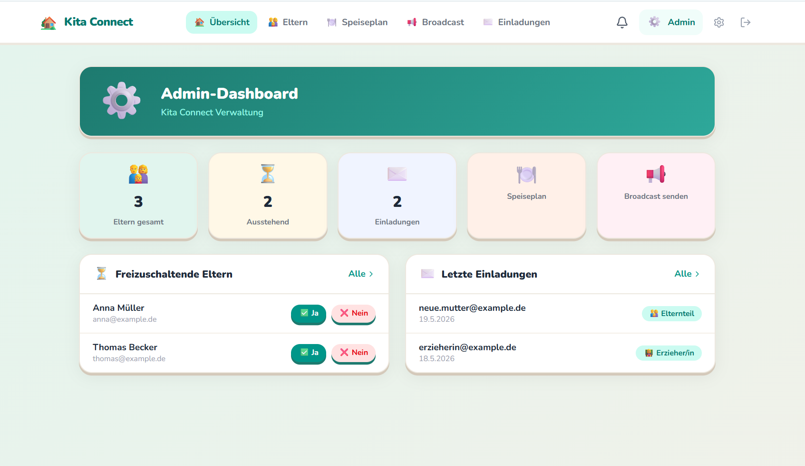
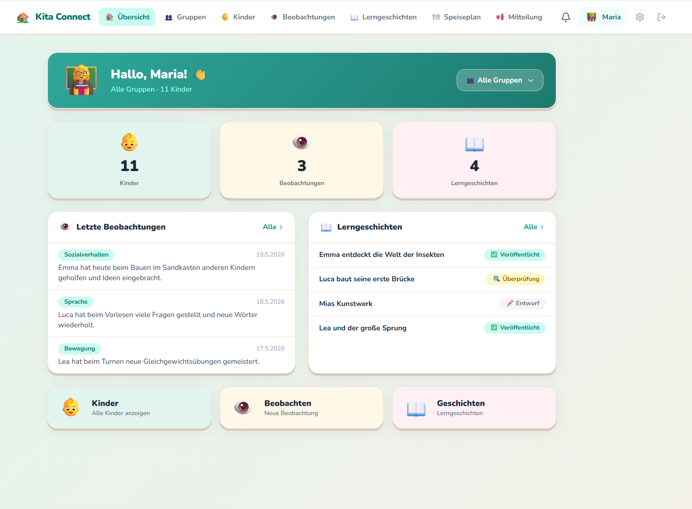
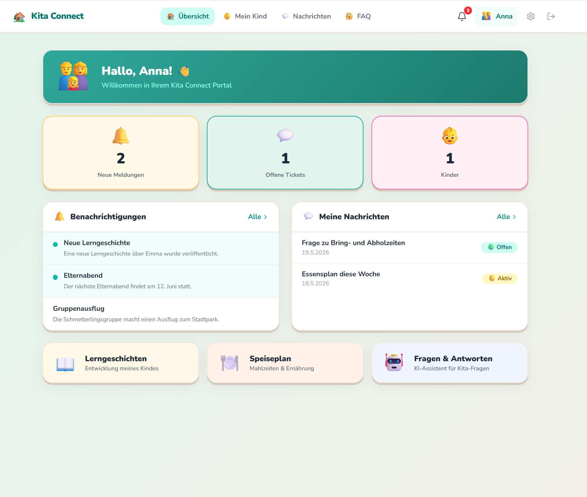

# Kita Connect

**Full-stack Kita management platform** — built for German daycare centers, designed to run at near-zero monthly cost with enterprise-grade security and GDPR compliance.

> Portfolio project by [Eugen Mueller](https://github.com/eugnmueller-87). Live at [app.kita-connect.cloud](https://app.kita-connect.cloud).

---

## Screenshots

| Admin Portal | Educator Portal | Parent Portal |
|---|---|---|
|  |  |  |

---

## What it does

Kita Connect replaces fragmented communication tools (WhatsApp groups, paper forms, phone calls) with a unified platform for parents, educators, and Kita management.

**For Parents**
- Secure portal to view their child's development documentation and learning stories
- Direct messaging with educators via ticket system
- Real-time in-app, email, and SMS notifications
- Multi-language: German, English, Turkish, Russian

**For Educators**
- Development observations (Sismik, Seldak, Perik standardized assessments)
- AI-assisted learning stories — GDPR-pseudonymized before AI processing
- Child milestone tracking and meal planning
- Broadcast announcements to all parents

**For Kita Management**
- Invite-only registration — no self-signup, full role-based access control
- Multi-tenant: one platform for multiple Kitas under one Träger
- Automated onboarding workflows via n8n
- Full GDPR compliance: audit log, right to deletion, consent tracking

---

## What's Live and Working

| Feature | Status |
|---------|--------|
| Multi-role auth (super_admin, traeger_admin, admin, teacher, parent) | Live |
| Invite-only registration with email + password | Live |
| Parent portal — dashboard, child view, messaging, FAQ | Live |
| Teacher portal — observations, learning stories, children | Live |
| Admin portal — invitations, broadcasts, user management | Live |
| Super Admin — cross-Kita management | Live |
| n8n automation — 8 workflows (invitations, tickets, broadcasts, AI) | Live |
| Email delivery via Resend + DKIM/SPF/DMARC verified | Live |
| Kafka event streaming via Redpanda — 24h GDPR retention | Live |
| GDPR: full account deletion, consent notice, audit log 90-day retention | Live |
| Row Level Security on all 18 tables | Live |
| AI pseudonymization before any external API call | Live |
| Vercel deployment — Frankfurt region | Live |
| Supabase — EU Ireland region | Live |
| Hostinger DNS — DKIM, SPF, DMARC configured | Live |

---

## Tech Stack

| Layer | Technology | Why |
|-------|-----------|-----|
| Frontend | Next.js 14 (App Router) | Free on Vercel, server components, middleware auth |
| Database | Supabase (EU Ireland) | Free tier, built-in RLS, Realtime, Auth |
| Auth | Supabase Auth — email + password | Industry standard, invite-only flow |
| Event Streaming | Redpanda (Kafka-compatible) | Stability, async decoupling, 24h GDPR retention |
| Automation | n8n (self-hosted) | German company, GDPR-compliant, 8 active workflows |
| Email | Resend (SMTP) | 3,000 emails/month free, EU region, DKIM/SPF/DMARC |
| SMS | seven.io | German provider, GDPR-native |
| Push | Web Push API (VAPID) | Browser-native, no cost, no third party |
| AI | Mistral AI (FAQ + moderation) | EU-based, used only for non-personal FAQ queries |
| DNS + Domain | Hostinger | kita-connect.cloud, all DNS records verified |
| Hosting | Vercel (Frankfurt) | EU region, zero config deploys |
| Logging | Supabase audit_log | No third-party logging, 90-day auto-purge |

---

## Architecture

```
Next.js App (Vercel - Frankfurt)
Parent / Teacher / Admin / Super Admin portals
Middleware: role-based auth guard on every route
                    |
                    | Server Components + API Routes
                    v
Supabase (EU Ireland)
PostgreSQL / Auth / RLS / Realtime / Storage
18 tables / audit_log (90-day) / ai_pseudonym_map
                    |
                    | Kafka Events via Redpanda (24h retention)
                    v
n8n Automation (self-hosted, 8 workflows)
Invitations / Tickets / Broadcasts / AI Stories
        |               |               |
        v               v               v
    Resend          seven.io        Mistral AI
    (Email)          (SMS)       (FAQ - no PII sent)
```

---

## GDPR and Security

### Data Residency
- Supabase: EU Ireland
- Vercel: Frankfurt
- n8n: self-hosted EU
- Mistral AI: EU-based (Paris) — only FAQ questions, no personal data

### Right to Deletion (GDPR Art. 17)
Full cascade delete via `delete_user_account()` DB function:
- Deletes children, observations, learning stories, photos, tickets, profile
- Deletes Supabase auth user via service role
- Audit entry logged before deletion
- Exposed via `DELETE /api/user/delete`

### Invite-Only Registration
- No self-signup — users register only via role-scoped invite token
- Token single-use, validated before and after registration
- Pending registrations auto-deleted after 48 hours (GDPR Art. 5)
- Passwords hashed by Supabase Auth (bcrypt)

### Row Level Security
Every table has RLS enabled and tested:
- Parents: own data only
- Teachers: Kita-scoped access
- Admins: own Kita only
- Super Admin: all Kitas

### AI Pseudonymization
- Child names replaced with Kind-A1B2 pseudonyms before any AI call
- ai_pseudonym_map table: RLS blocks all client access
- No real names, birth dates, or identifiers sent to external services

### Audit Log
- Every sensitive action logged: actor_id, action, target, ip, user_agent
- Write-only via security definer function — tamper-proof
- Auto-purged after 90 days via pg_cron
- Readable by admin role only

### Kafka Retention
- Redpanda configured with 24-hour retention per GDPR decision
- Events used only as delivery queue between app and n8n
- No long-term personal data stored in message broker

---

## API Routes

| Method | Route | Auth | Description |
|--------|-------|------|-------------|
| POST | /api/admin/invite | admin+ | Send role-scoped invitation email |
| DELETE | /api/admin/invite/[id] | admin+ | Delete unused invitation |
| POST | /api/admin/broadcast | admin+ | Broadcast to all parents |
| POST | /api/register | anon | Complete registration via invite token |
| DELETE | /api/user/delete | any | Full GDPR account deletion |
| POST | /api/teacher/observations | teacher | Create child observation |
| POST | /api/tickets | parent/teacher | Create or reply to ticket |

---

## Cost Analysis

### Current — Development / Early Pilot

| Service | Plan | Monthly Cost |
|---------|------|-------------|
| Vercel | Hobby (free) | 0 EUR |
| Supabase | Free tier | 0 EUR |
| Resend | Free (3,000 emails/month) | 0 EUR |
| n8n + Redpanda | Self-hosted VPS | 5–10 EUR |
| Hostinger domain | kita-connect.cloud | 1 EUR |
| Mistral AI | Pay-per-use (FAQ only) | 0–2 EUR |
| seven.io SMS | Pay-per-use | 0–5 EUR |
| **Total** | | **6–18 EUR/month** |

### At Scale — 100 Kitas, ~5,000 users

| Service | Plan | Monthly Cost |
|---------|------|-------------|
| Vercel Pro | Included bandwidth | 20 EUR |
| Supabase Pro | 8GB DB, 100GB storage | 25 EUR |
| Resend Growth | 50,000 emails/month | 20 EUR |
| n8n + Redpanda VPS | Scaled server | 20–40 EUR |
| Mistral AI | Higher volume | 5–15 EUR |
| seven.io SMS | ~1,000 SMS/month | 10–20 EUR |
| **Total** | | **100–120 EUR/month** |

**Unit economics: under 1.20 EUR per Kita per month at 100 Kitas**

---

## Roadmap

| Phase | Description | Status |
|-------|-------------|--------|
| 0 — Foundation | DB schema (18 tables), RLS, Supabase Auth | Done |
| 1 — Automation | n8n — 8 workflows live and tested | Done |
| 2 — Portal | Next.js — all screens, 3 role portals | Done |
| 3 — Live | Auth, GDPR, Kafka, email delivery, real users | Done |
| 4 — Mobile | PWA optimization + native iOS/Android | Next |
| 5 — Launch | DPAs, privacy policy page, marketing site | Next |
| 6 — Monetization | Stripe, pricing tiers, pilot Kitas | Planned |

### Immediate Next Steps
1. **Mobile register flow** — fix email link handling on mobile browsers
2. **PWA** — installable on home screen, offline support for educators on tablets
3. **Reset password page** — /reset-password after Supabase email redirect
4. **Data Processing Agreements** — sign DPAs with Resend and seven.io
5. **Privacy policy** — public page at kita-connect.cloud/datenschutz
6. **First pilot Kita** — onboard real users and collect feedback

---

## License

Private project — not open source. Repository is public for portfolio purposes.
