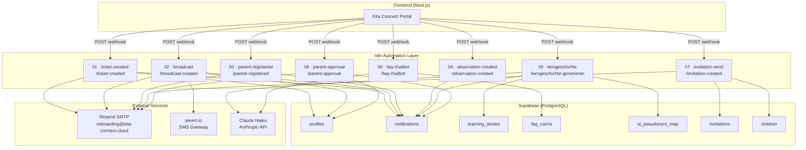
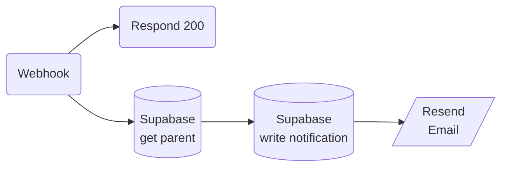
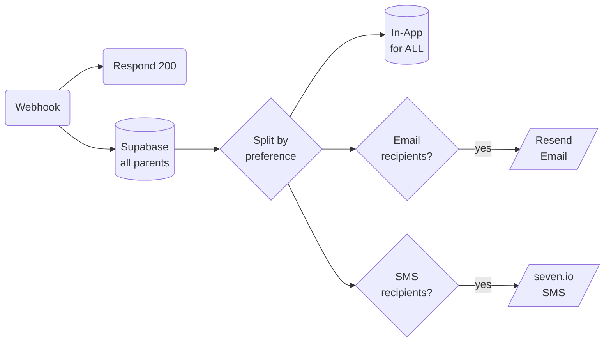
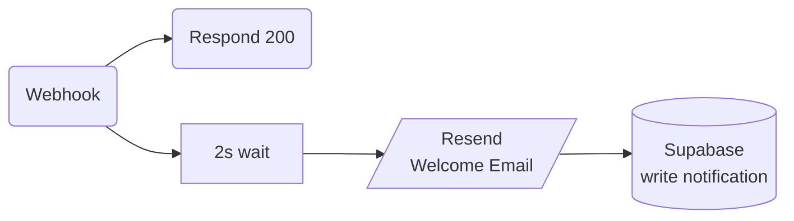
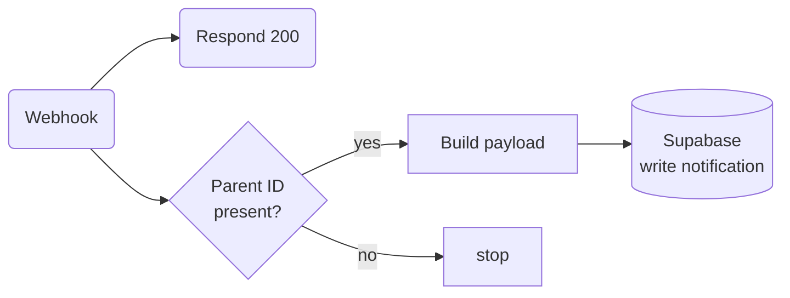
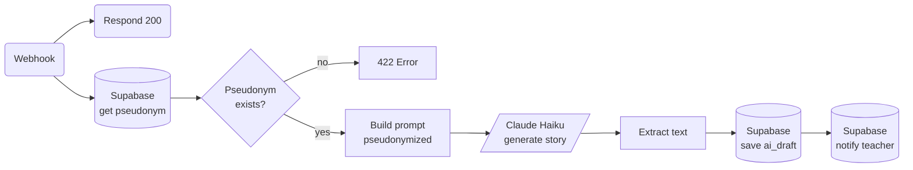
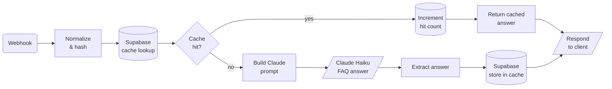
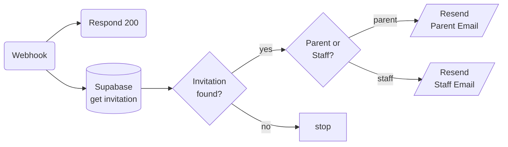
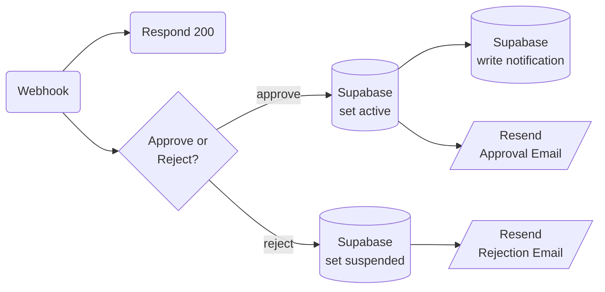

# Kita Connect — System Architecture

## Complete Workflow Overview

---

## Workflow Details

### 01 · Ticket Reply Notification
**Trigger:** Teacher posts a reply to a parent's support ticket  
**Flow:** Fetch parent data → Write in-app notification → Send email

---

### 02 · Broadcast to All Parents
**Trigger:** Admin sends a broadcast message  
**Flow:** Fetch all parents → Split by preference → In-app for all + Email/SMS if opted in

---

### 03 · Welcome Email on Registration
**Trigger:** New parent registers  
**Flow:** 2s delay → Welcome email → In-app notification

---

### 04 · Observation Notification
**Trigger:** Teacher adds a child development observation  
**Flow:** Check parent_id → Build payload → Write in-app notification

---

### 05 · AI Learning Story Generation (GDPR-Pseudonymized)
**Trigger:** Teacher requests a learning story draft  
**Flow:** Fetch pseudonym → Build prompt (no real name) → Claude Haiku → Save draft → Notify teacher

---

### 06 · FAQ Chatbot (Cache-First)
**Trigger:** Parent or teacher asks a question  
**Flow:** Normalize & hash question → Check cache → Cache hit: return immediately / Cache miss: ask Claude → Store answer

---

### 07 · Invitation Email
**Trigger:** Admin/Teacher invites a parent or new staff member  
**Flow:** Fetch invitation details → Parent or Staff? → Send appropriate email

---

### 08 · Parent Account Approval
**Trigger:** Admin approves or rejects a pending parent account  
**Flow:** Approve → Activate in DB + notify + email / Reject → Suspend + email

---

## Notification Channels

| Channel | Service | Workflows |
|---------|---------|-----------|
| In-App | Supabase `notifications` table | 01, 02, 03, 04, 05, 08 |
| Email | Resend SMTP (`onboarding@kita-connect.cloud`) | 01, 02, 03, 07, 08 |
| SMS | seven.io | 02 (opt-in only) |

## AI Usage

| Workflow | Model | Purpose | GDPR |
|----------|-------|---------|------|
| 05 | Claude Haiku | Generate learning story draft | Pseudonymized — no real names sent to API |
| 06 | Claude Haiku | Answer FAQ questions | No personal data in prompts |

## Database Tables Used

| Table | Purpose |
|-------|---------|
| `profiles` | User accounts (parents, teachers, admins) with notification preferences |
| `notifications` | In-app notification inbox |
| `learning_stories` | AI-generated story drafts |
| `faq_cache` | Cached FAQ answers (hash → answer) |
| `ai_pseudonym_map` | Maps child_id → pseudonym for GDPR-safe AI calls |
| `invitations` | Pending invitations with expiry |
| `children` | Child profiles linked to parents |
